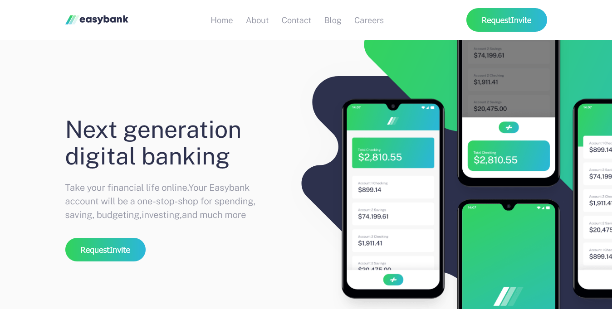

# Frontend Mentor - Easybank landing page solution

This is a solution to the [Easybank landing page challenge on Frontend Mentor](https://www.frontendmentor.io/challenges/easybank-landing-page-WaUhkoDN).

## Table of contents

- [Overview](#overview)
  - [The challenge](#the-challenge)
  - [Screenshot](#screenshot)
  - [Links](#links)
  - [Built with](#built-with)
  - [What I learned](#what-i-learned)
  - [Continued development](#continued-development)
  - [Useful resources](#useful-resources)
- [Author](#author)
- [Acknowledgments](#acknowledgments)

### The challenge

Users should be able to:

- View the optimal layout for the site depending on their device's screen size
- See hover states for all interactive elements on the page

### Screenshot

### Links

- Solution URL: [Add solution URL here](https://your-solution-url.com)
- Live Site URL: [Add live site URL here](https://your-live-site-url.com)

### Built with

- Semantic HTML5 markup
- SASS
- Flexbox
- CSS Grid
- Mobile-first workflow

### What I learned

I really developed the use of Sass for styling websites, I really got the grasp of it. I also refined my css. Some bits were challenging but i was able to research on google to find answers.

### Continued development

I would like to learn more about css grids as I had a bit of challenge using it.
Positioning in Css was challenging at times.

### Useful resources

- [resource 1](https://codepen.io) - This helped me with building out the harmbuger component in the navigation section.
- [Example resource 2](https://css-tricks.com/snippets/css/a-guide-to-flexbox/) - This is an amazing cheat-sheet for flexbox and its properties with detailed explanations.

## Author

- Website - [Add your name here](https://www.your-site.com)
- Frontend Mentor - [@yourusername](https://www.frontendmentor.io/profile/yourusername)
- Twitter - [@yourusername](https://www.twitter.com/yourusername)

## Acknowledgments

codercoder(jessica chan).
